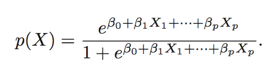
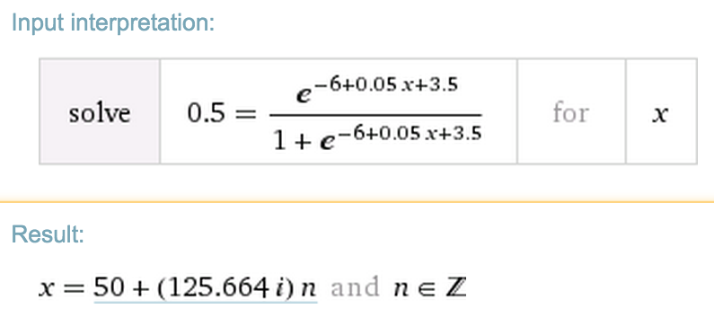

Devon Zuegel &nbsp; // &nbsp; 11 Oct 2015 &nbsp; // &nbsp; STATS 202

# Problem Set 3 #

[web.stanford.edu/class/stats202/content/viewhw.html?hw3](web.stanford.edu/class/stats202/content/viewhw.html?hw3)

## Problem 1 ##

*Chapter 4, Exercise 4 (Sec. 4.7, p. 168)*

#### Part A ####

- `X` is uniformly distributed on `[0, 1]`.
- When predicting a test observation's response, we look the 10% of the range closest to that observation.
    + If our test observation has value `X = 0.6`, we look at `[0.55, 0.65]`.
    + If our test observation has value `X = 0.02`, we look at `[0.00, 0.10]`.
    + If our test observation has value `X = 0.98`, we look at `[0.90, 1.00]`.

Since at any give point we're looking at 10% of the range and the points are evenly distributed along that range, we'd expect to be looking at 10% of the data on average each time.

#### Part B ####

- `X1` is uniformly distributed on `[0, 1]`, and `X2` is uniformly distributed on `[0, 1]`.
- Similar rules as in part a.

Since at any give point we're looking at 10% of `X1`'s range and 10% of `X2`'s range and the points are evenly distributed along those two ranges, we'd expect to be looking at 1% of the data on average each time.

We can think about it as a square:

```md
   0   1   2   3   4   5   6   7   8   9
0  - | - | - | - | - | - | - | - | - | - 
1  - | - | - | - | - | - | - | - | - | - 
2  - | - | - | - | - | - | - | - | - | - 
3  - | - | - | - | - | X | - | - | - | - 
4  - | - | - | - | - | - | - | - | - | - 
5  - | - | - | - | - | - | - | - | - | - 
6  - | - | - | - | - | - | - | - | - | - 
7  - | - | - | - | - | - | - | - | - | - 
8  - | - | - | - | - | - | - | - | - | - 
9  - | - | - | - | - | - | - | - | - | - 
```

If we look at just 10% of the x-dimension (let's say the `5`th column) and then also just 10% of the y-dimension (let's say the `3`rd row), we get `1/100 = 1%` of the available cells.

#### Part C ####

If we have 100 features (a.k.a. 100 dimensions) and we look at just 10% of the range for each of them, we look at just a tiny portion ($10^{-100}$) of the data.

#### Part D ####

Let's say we have 1 billion ($10^{9}$) training observations. That's a lot of data! However, consider trying to predict the response for some test observation `m` with 100 features, where we look at just the observations that fall within 10% of each range from `m`. Of the 1 billion points we started out with, we'd expect to have $10^{9} \cdot 10^{-100} = 10^{-91}$ observations to look at. That is still effectively 0, which doesn't help us at all.

#### Part E ####

The expected length of the hypercube is:

- hypercube's length is $(\frac{1}{10})^{1}$`= 10%` when `p = 1`
- hypercube's length is $(\frac{1}{10})^{2}$`= 1%` when `p = 2`
- hypercube's length is $(\frac{1}{10})^{100}$ when `p = 100`

## Problem 2 ##

*Chapter 4, Exercise 6 (Sec. 4.7, p. 170).*



### Part A ###

X1 = hours studied, X2 = undergrad GPA, and Y = receive an A. We fit a logistic regression and produce estimated coefficient, βˆ0 = −6, βˆ1 = 0.05, βˆ2 = 1.

$$\begin{align}
x &= \text{"3.5 GPA && studies for 40h"} \\\\
Pr(x) = 0.5 &= \dfrac{e^{\beta_0 + \beta_1X_1 + \beta_2X_2}}{1 + e^{\beta_0 + \beta_1X_1 + \beta_2X_2}} \\\\
&= \dfrac{e^{-6 + 40 \cdot 0.05 + 3.5 \cdot 1.0}}{1 + e^{-6 + 40 \cdot 0.05 + 3.5 \cdot 1.0}} \\\\
&= \boxed{0.377541}
\end{align}$$

### Part B ###

$$\begin{align}
x &= \text{"3.5 GPA && studies for 40h"} \\\\
Pr(x) = 0.5 &= \dfrac{e^{\beta_0 + \beta_1X_1 + \beta_2X_2}}{1 + e^{\beta_0 + \beta_1X_1 + \beta_2X_2}} \\\\
&= \dfrac{e^{-6 + 0.05 \cdot \texttt{num_hours} + 3.5 \cdot 1.0}}{1 + e^{-6 + 0.05 \cdot \texttt{num_hours} + 3.5 \cdot 1.0}} \\\\
&= \boxed{50 \text{ hours}}
\end{align}$$



## Problem 3 ##

*Chapter 4, Exercise 8 (Sec. 4.7, p. 170).*


## Problem 4 ##

*Chapter 4, Exercise 10 (Sec. 4.7, p. 171). In part (i), please be concise; only describe and provide the output of your best prediction.*

## Problem 5 ##
